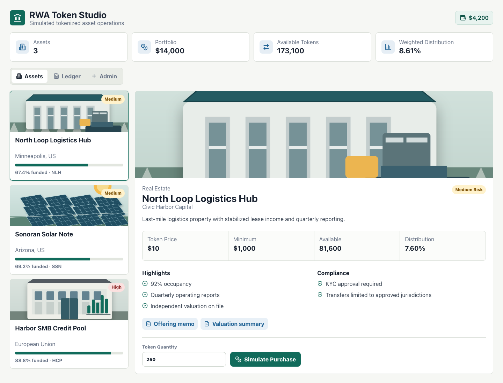

# RWA Token Studio

Educational real-world asset tokenization platform with simulated assets, wallet balances, compliance flags, purchase checks, and an ownership ledger.

This repository is designed as a polished GitHub base for exploring asset tokenization product flows without handling real investor money, securities issuance, custody, KYC, or regulated transfers.



Live demo: <https://hasserchatphon.github.io/rwa-token-studio/>

## What It Includes

- Asset catalog with real-world asset style data.
- Asset detail workflow with token supply, price, funding progress, documents, and risk flags.
- Simulated wallet balance and token purchase flow.
- TypeScript domain package for purchase validation and portfolio math.
- Fastify API with SQLite persistence through Prisma Client.
- Admin flow for creating persisted demo assets when the API is configured.
- Reference smart contract showing allowlisted ERC-20 style transfer restrictions.
- Docs covering architecture, compliance boundaries, roadmap, and future API contracts.
- GitHub Actions CI for lint, tests, and build.

## Quick Start

```bash
npm install
npm run dev
```

The web app runs at the Vite URL printed in the terminal, usually `http://localhost:5173`.

## Full-Stack Local Demo

```bash
cp .env.example .env
npm install
npm run db:init
npm run db:seed
npm run dev:api
```

In a second terminal:

```bash
npm run dev:web
```

The API runs at `http://127.0.0.1:8787`. The web app reads `VITE_API_URL` when present and otherwise falls back to the static demo data used by the GitHub Pages deployment.

## Useful Scripts

```bash
npm run dev       # start the React app
npm run dev:api   # start the Fastify API
npm run db:init   # initialize the local SQLite schema
npm run db:seed   # seed demo assets, investor, holdings, and ledger
npm run lint      # run ESLint
npm run test      # run domain and API tests
npm run build     # typecheck and build the API and web app
npm run validate  # lint, test, and build
```

## Repository Map

```text
apps/api            Fastify API, Prisma schema, SQLite setup, API tests
apps/web            React + Vite studio interface
packages/domain     Tokenized asset types, seed data, and rules
contracts           Reference Solidity contract, not audited
docs                Product, compliance, architecture, and API notes
.github/workflows   CI configuration
```

## Product Boundary

RWA Token Studio is a prototype. It does not provide investment advice, broker-dealer services, transfer-agent services, custody, legal structuring, KYC/AML, tax reporting, or production blockchain settlement.

Use it to demonstrate product thinking, data modeling, compliance-aware UX, and engineering structure.

## Next Milestones

1. Add authenticated user accounts and role-based admin access.
2. Add issuer onboarding and document verification workflows.
3. Connect the simulated ledger to a testnet contract adapter.
4. Add admin review states for KYC, accreditation, and jurisdiction rules.
5. Add audit logs and exportable investor statements.
